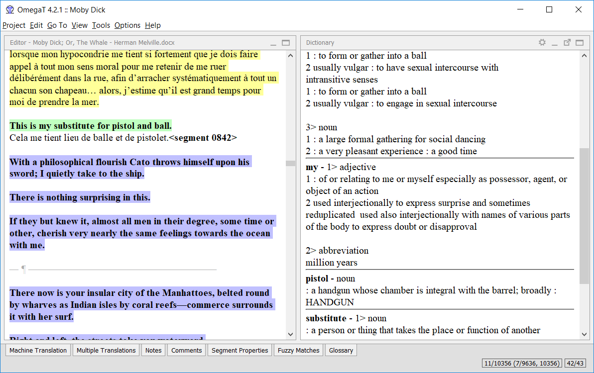

Dictionaries
============

How to download and install dictionaries
========================================

Dictionaries in OmegaT are based on the StarDict or on the Lingvo DSL
format. To install the necessary files for the StarDict format, proceed
as follows:

-  Search for the required language combination - for instance on the
   `dictionary links given by the OmegaT
   Wiki <https://sourceforge.net/p/omegat/wiki/Reference%20Material/>`__.

-  Download the file - it should be a ``tarball`` archive (extension
   *tar.bz* or *tar.bz2*).

-  Use untar utility (or its equivalent, for instance ``winrar`` in 
   Windows) to extract its contents into the project folder "Dictionary".
   There should be three files, with extensions *dz*, *idx* and *ifo*.

Note that in addition to "source-target" dictionaries you can, using the
Dictionary feature, obtain access to information such as:

-  Webster's Revised Unabridged Dictionary (1913)

-  Longman Dictionary of Contemporary English

-  The Britannica Concise Encyclopedia

-  etc...

Some of the dictionaries have no strings attached - i.e. are "Free to
use", and others, like the selection above, are under the GPL license.
The following example shows Merriam Webster 10th dictionary "in action":

   Merriam Webster dictionary - use

Problems with dictionaries
==========================

-  Check that your dict files are in the correct folder (or in a
   subfolder below it). Check in Project > Properties.

-  Does the folder contain three files of the same name, with
   extensions? If only one file is present, check its extension. If it
   is *tar.bz*, you have forgotten to unpack (untar) it.
