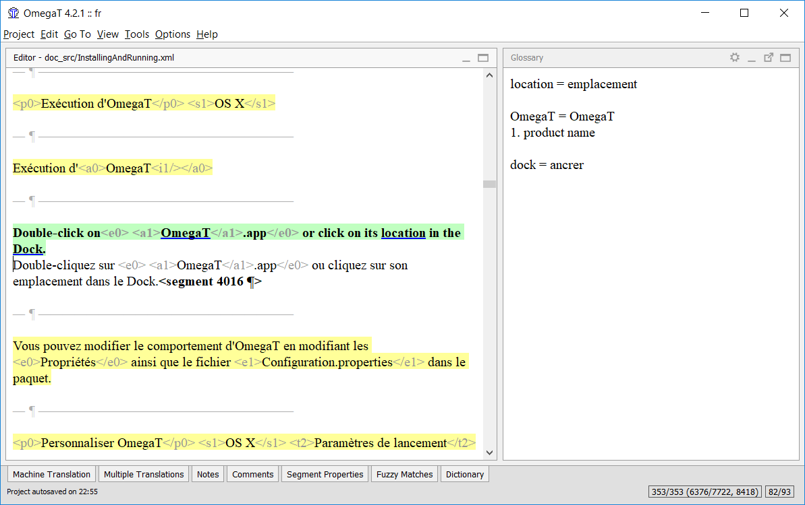
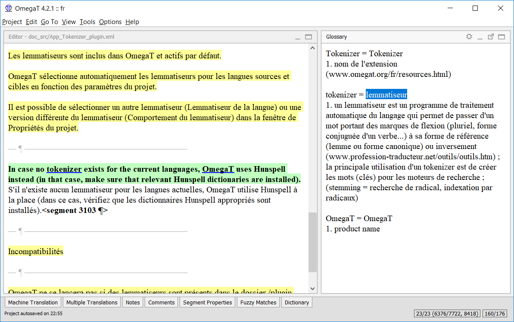
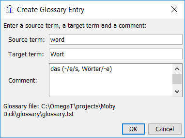

Glossaries
==========

Glossaries are files created and updated manually for use in OmegaT.

If an OmegaT project contains one or more glossaries, any terms in the
glossary which are also found in the current segment will be
automatically displayed in the Glossary viewer.

You define its location and name in the project properties dialog. The
extension must be ``.txt`` or ``.utf8`` (if not, it will be added). The
location of the file must be within the ``/glossary`` folder, but it can
be in a deeper folder (e.g., ``glossary/sub/glossary.txt``). The file
does not need to exist when setting it, it will be created (if
necessary) when adding a glossary entry. If the file already exists, no
attempt is done to verify the format or the character set of the file:
the new entries will always be in tab-separated format and UTF-8. As the
existing content will not be touched, damage to an existing file would
be limited.

Usage
=====

To use an existing glossary, simply place it in the ``/glossary`` folder
after creating the project. OmegaT automatically detects glossary files
in this folder when a project is opened. Terms in the current segment
which OmegaT finds in the glossary file(s) are displayed in the Glossary
pane:

   Glossary pane

The word before the = sign is the source term, and its translation is
(or are) the words after =. The vocabulary entry can have a comment
added. The glossary function only finds exact matches with the glossary
entry (e.g. does not find inflected forms etc.). New terms can be added
manually to the glossary file(s) during translation, for example in a
text editor. Newly added terms will not be recognized once the changes
in the text file have been saved.

The source term does not have to be a single-word item, as the next
example shows:

   multiple words entries in glossaries - example

The underlined item "pop-up menu" can be found in the glossary pane as
"pojavni menu". Highlighting it in the Glossary pane and then
rightclicking insets at the cursor position in the target segment. [1]_

File format
===========

Glossary files are simple plain text files containing three-column,
tab-delimited lists with the source and target terms in the first and
second columns respectively. The third column can be used for additional
information. You can have entries with the target column missing, i.e.
just containing the source term and the comment.

The encoding of glossaries is determined automatically. Of course, the
encoding must be compatible with both the languages contained, so
Unicode is recommended.

Also supported is the CSV format. This format is the same as the tab
separated one: source term, target term. Comment fields are separated by
a comma ','. Strings can be enclosed by quotes ", which allows having a
comma inside a string:

``"This is a source term, which contains a comma","c'est un terme, qui contient une virgule"``

In addition to the plain text format, TBX format is also supported as a
read-only glossary format. The location of the ``.tbx`` file must be
within the ``/glossary`` folder, but it can be in a deeper folder (e.g.,
``glossary/sub/MyGlossary.tbx``).

TBX - Term Base eXchange - is the open, XML-based standard for
exchanging structured terminological data, TBX has been approved as an
international standard by LISA and ISO. If you have an existing
terminology handling system it is quite possible it offers the export of
terminology data via TBX format. `Microsoft Terminology
Collection <http://www.microsoft.com/Language/en-US/Terminology.aspx>`__
can be downloaded in nearly 100 languages and can serve as a cornerstone
IT glossary.

Note: the ``.tbx`` output of MultiTerm seems to not be reliable
(November 2013), it is better to use the ``.tab`` output of MultiTerm
instead.

How to create glossaries
========================

The project setting allows one to enter a name for a writable glossary
file (see beginning of this chapter). Right-click in the glossary pane
or press Ctrl+Shift+G to add a new entry. A dialog opens, allowing you
to enter the source term, target term and any comments you may have:

|image0|

The contents of glossary files are kept in memory and are loaded when
the project is opened or reloaded. Updating a glossary file is thus
rather simple: press Ctrl+Shift+G and enter the new term, its
translation and any comments you may have (ensuring you press tab
between the fields) and save the file. The contents of the glossary pane
will be updated accordingly.

The location of the writable glossary file can be set in the Project >
Properties ...dialog. The recognized extensions are ``TXT`` and ``UTF8``

**Note:**\ Of course there are other ways and means to create a simple
file with tab delimited entries. Nothing speaks against using Notepad++
on Windows, GEdit on Linux for instance or some spreadsheet program for
this purpose: any application, that can handle UTF-8 (or UTF-16 LE) and
that can show white space (so that you do not miss the required TAB
characters) can be used.

Priority glossary
=================

The results from the priority glossary (by default,
glossary/glossary.txt) appear in first places in the Glossary pane and
in TransTips.

As entries can mix words from priority and non priority glossaries, the
words from the priority glossary are displayed in bold.

Common glossary problems
========================

**Problem: No glossary terms are displayed - possible causes:**

-  No glossary file found in the "glossary" folder.

-  The glossary file is empty.

-  The items are not separated with a TAB character.

-  The glossary file does not have the correct extension (.tab, .utf8 or
   .txt).

-  There is no EXACT match between the glossary entry and the source
   text in your document - for instance plurals.

-  The glossary file does not have the correct encoding.

-  There are no terms in the current segment which match any terms in
   the glossary.

-  One or more of the above problems may have been fixed, but the
   project has not been reloaded.

**Problem: In the glossary pane, some characters are not displayed
properly**

-  ...but the same characters are displayed properly in the Editing
   pane: the extension and the file encoding do not match.

.. [1]
   Note that in the above case, this is just half (or even less) of the
   story, as the target language (Slovenian) uses declension. So the
   inserted "pojavni meni" in the nominative form - has to be changed to
   "pojavnem meniju" , i.e. to the locative. So it is probably faster to
   type the term correctly right away without bothering with the
   glossary and its shortcuts.

