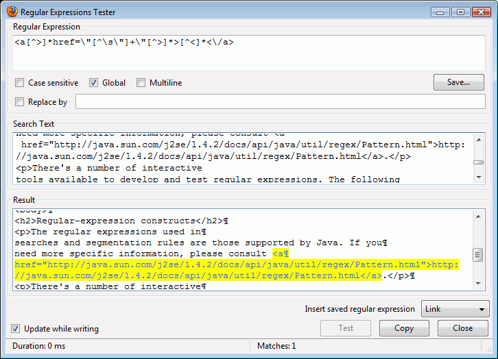

Regular expressions
===================

The regular expressions (or regex for short) used in searches and
segmentation rules are those supported by Java. Should you need more
specific information, consult the `Java Regex
documentation <http://download.oracle.com/javase/1.6.0/docs/api/java/util/regex/Pattern.html>`__.
See additional references and examples below.

    **Note**

    This chapter is intended for advanced users, who need to define
    their own variants of segmentation rules or devise more complex and
    powerful key search items.

+-----------------+----------------------------------------------------------------------------------+
| The construct   | ... matches the following                                                        |
+=================+==================================================================================+
| (?i)            | Enables case-insensitive matching (by default, the pattern is case-sensitive).   |
+-----------------+----------------------------------------------------------------------------------+

Table: Regex - Flags

+-----------------+------------------------------------------------------------------+
| The construct   | ... matches the following                                        |
+=================+==================================================================+
| x               | The character x, except the following...                         |
+-----------------+------------------------------------------------------------------+
| \\uhhhh         | The character with hexadecimal value 0xhhhh                      |
+-----------------+------------------------------------------------------------------+
| \\t             | The tab character ('\\u0009')                                    |
+-----------------+------------------------------------------------------------------+
| \\n             | The newline (line feed) character ('\\u000A')                    |
+-----------------+------------------------------------------------------------------+
| \\r             | The carriage-return character ('\\u000D')                        |
+-----------------+------------------------------------------------------------------+
| \\f             | The form-feed character ('\\u000C')                              |
+-----------------+------------------------------------------------------------------+
| \\a             | The alert (bell) character ('\\u0007')                           |
+-----------------+------------------------------------------------------------------+
| \\e             | The escape character ('\\u001B')                                 |
+-----------------+------------------------------------------------------------------+
| \\cx            | The control character corresponding to x                         |
+-----------------+------------------------------------------------------------------+
| \\0n            | The character with octal value 0n (0 <= n <= 7)                  |
+-----------------+------------------------------------------------------------------+
| \\0nn           | The character with octal value 0nn (0 <= n <= 7)                 |
+-----------------+------------------------------------------------------------------+
| \\0mnn          | The character with octal value 0mnn (0 <= m <= 3, 0 <= n <= 7)   |
+-----------------+------------------------------------------------------------------+
| \\xhh           | The character with hexadecimal value 0xhh                        |
+-----------------+------------------------------------------------------------------+

Table: Regex - Character

+-----------------+--------------------------------------------------------------------------------------------------------------------------------------------------------------------+
| The construct   | ...matches the following                                                                                                                                           |
+=================+====================================================================================================================================================================+
| \\              | Nothing, but quotes the following character. This is required if you would like to enter any of the meta characters !$()\*+.<>?[\\]^{\|} to match as themselves.   |
+-----------------+--------------------------------------------------------------------------------------------------------------------------------------------------------------------+
| \\\\            | For example, this is the backslash character                                                                                                                       |
+-----------------+--------------------------------------------------------------------------------------------------------------------------------------------------------------------+
| \\Q             | Nothing, but quotes all characters until \\E                                                                                                                       |
+-----------------+--------------------------------------------------------------------------------------------------------------------------------------------------------------------+
| \\E             | Nothing, but ends quoting started by \\Q                                                                                                                           |
+-----------------+--------------------------------------------------------------------------------------------------------------------------------------------------------------------+

Table: Regex - Quotation

+------------------------+-----------------------------------------------------------------------------------------------------------------------------------------+
| The construct          | ...matches the following                                                                                                                |
+========================+=========================================================================================================================================+
| \\p{InGreek}           | A character in the Greek block (simple `block <http://download.oracle.com/javase/1.6.0/docs/api/java/util/regex/Pattern.html#ubc>`__)   |
+------------------------+-----------------------------------------------------------------------------------------------------------------------------------------+
| \\p{Lu}                | An uppercase letter (simple `category <http://download.oracle.com/javase/1.6.0/docs/api/java/util/regex/Pattern.html#ubc>`__)           |
+------------------------+-----------------------------------------------------------------------------------------------------------------------------------------+
| \\p{Sc}                | A currency symbol                                                                                                                       |
+------------------------+-----------------------------------------------------------------------------------------------------------------------------------------+
| \\P{InGreek}           | Any character except one in the Greek block (negation)                                                                                  |
+------------------------+-----------------------------------------------------------------------------------------------------------------------------------------+
| [\\p{L}&&[^\\p{Lu}]]   | Any letter except an uppercase letter (subtraction)                                                                                     |
+------------------------+-----------------------------------------------------------------------------------------------------------------------------------------+

Table: Regex - Classes for Unicode blocks and categories

+-----------------+-------------------------------------------------+
| The construct   | ...matches the following                        |
+=================+=================================================+
| [abc]           | a, b, or c (simple class)                       |
+-----------------+-------------------------------------------------+
| [^abc]          | Any character except a, b, or c (negation)      |
+-----------------+-------------------------------------------------+
| [a-zA-Z]        | a through z or A through Z, inclusive (range)   |
+-----------------+-------------------------------------------------+

Table: Regex - Character classes

+-----------------+------------------------------------------------+
| The construct   | ...matches the following                       |
+=================+================================================+
| .               | Any character (except for line terminators)    |
+-----------------+------------------------------------------------+
| \\d             | A digit: [0-9]                                 |
+-----------------+------------------------------------------------+
| \\D             | A non-digit: [^0-9]                            |
+-----------------+------------------------------------------------+
| \\s             | A whitespace character: [ \\t\\n\\x0B\\f\\r]   |
+-----------------+------------------------------------------------+
| \\S             | A non-whitespace character: [^\\s]             |
+-----------------+------------------------------------------------+
| \\w             | A word character: [a-zA-Z\_0-9]                |
+-----------------+------------------------------------------------+
| \\W             | A non-word character: [^\\w]                   |
+-----------------+------------------------------------------------+

Table: Regex - Predefined character classes

+-----------------+----------------------------+
| The construct   | ...matches the following   |
+=================+============================+
| ^               | The beginning of a line    |
+-----------------+----------------------------+
| $               | The end of a line          |
+-----------------+----------------------------+
| \\b             | A word boundary            |
+-----------------+----------------------------+
| \\B             | A non-word boundary        |
+-----------------+----------------------------+

Table: Regex - Boundary matchers

+-----------------+----------------------------+
| The construct   | ...matches the following   |
+=================+============================+
| X\ *?*          | X, once or not at all      |
+-----------------+----------------------------+
| X\ *\**         | X, zero or more times      |
+-----------------+----------------------------+
| X\ *+*          | X, one or more times       |
+-----------------+----------------------------+

Table: Regex - Greedy quantifiers

    **Note**

    greedy quantifiers will match as much as they can. For example, *a+*
    will match the aaa in *aaabbb*

+-----------------+----------------------------+
| The construct   | ...matches the following   |
+=================+============================+
| X??             | X, once or not at all      |
+-----------------+----------------------------+
| X\*?            | X, zero or more times      |
+-----------------+----------------------------+
| X+?             | X, one or more times       |
+-----------------+----------------------------+

Table: Regex - Reluctant (non-greedy) quantifiers

    **Note**

    non-greedy quantifiers will match as little as they can. For
    example, *a+?* will match the first *a* in *aaabbb*

+-----------------+----------------------------+
| The construct   | ...matches the following   |
+=================+============================+
| XY              | X followed by Y            |
+-----------------+----------------------------+
| X\|Y            | Either X or Y              |
+-----------------+----------------------------+
| (XY)            | XY as a single group       |
+-----------------+----------------------------+

Table: Regex - Logical operators

Regex tools and examples of use
===============================

A number of interactive tools are available to develop and test regular
expressions. They generally follow much the same pattern (for an example
from the Regular Expression Tester see below): the regular expression
(top entry) analyzes the search text (Text box in the middle) , yielding
the hits, shown in the result Text box.

   Regex Tester

See `The Regex Coach <http://weitz.de/regex-coach/>`__ for
Windows,Linux, FreeBSD versions of a stand-alone tool. This is much the
same as the above example.

A nice collection of useful regex cases can be found in OmegaT itself
(see Options > Segmentation). The following list includes expressions
you may find useful when searching through the translation memory:

+-------------------------+------------------------------------------------------------------------------------------------------------------------------+
| Regular expression      | Finds the following:                                                                                                         |
+=========================+==============================================================================================================================+
| (\\b\\w+\\b)\\s\\1\\b   | double words                                                                                                                 |
+-------------------------+------------------------------------------------------------------------------------------------------------------------------+
| [\\.,]\\s\*[\\.,]+      | comma or a period, followed by spaces and yet another comma or period                                                        |
+-------------------------+------------------------------------------------------------------------------------------------------------------------------+
| \\. \\s+$               | extra spaces after the period at the end of the line                                                                         |
+-------------------------+------------------------------------------------------------------------------------------------------------------------------+
| \\s+a\\s+[aeiou]        | English: words, beginning with vowels, should generally be preceded by "an", not "a"                                         |
+-------------------------+------------------------------------------------------------------------------------------------------------------------------+
| \\s+an\\s+[^aeiou]      | English: the same check as above, but concerning consonants ("a", not "an")                                                  |
+-------------------------+------------------------------------------------------------------------------------------------------------------------------+
| \\s{2,}                 | more than one space                                                                                                          |
+-------------------------+------------------------------------------------------------------------------------------------------------------------------+
| \\.[A-Z]                | Period, followed by an upper-case letter - possibly a space is missing between the period and the start of a new sentence?   |
+-------------------------+------------------------------------------------------------------------------------------------------------------------------+
| \\bis\\b                | search for “is”, not “this” or “isn't” etc.                                                                                  |
+-------------------------+------------------------------------------------------------------------------------------------------------------------------+

Table: Regex - Examples of regular expressions in translations
