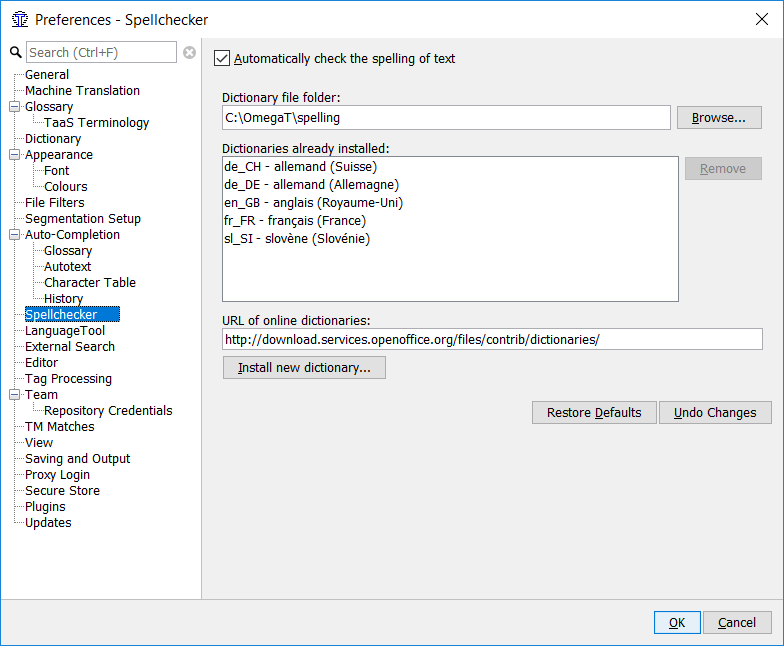
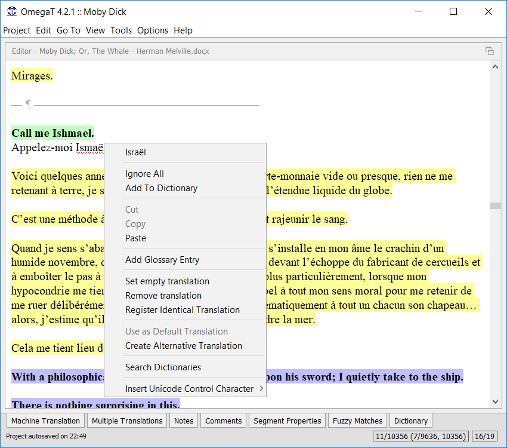

Spell checker
=============

OmegaT has a built-in spell checker based on the spelling checker used
in Apache OpenOffice, LibreOffice, Firefox and Thunderbird. It is
consequently able to use the huge range of free spelling dictionaries
available for these applications.

Installing spelling dictionaries
================================

Before the spell check function can be used, a suitable dictionary or
dictionaries (i.e. for your target language) must be installed. To
install spelling dictionaries, follow this procedure:

-  In your file manager, create a new folder in a suitable location in
   which to store spelling dictionaries (D:\\Translations\\spellcheckers
   in the example below).

-  In OmegaT, select Options > Spell Checking, then click Choose beside
   the Dictionary file folder field. Navigate to and select the folder
   you created for dictionaries.

-  Place the dictionary files you wish to use in this folder. There are
   essentially two ways in which you can do this. You can either copy
   files manually, i.e. from elsewhere on your system, using your file
   manager; or you can use OmegaT's **"Install new dictionary"**
   function to provide a list of available dictionaries to select from.
   Note that the "Install" function requires an Internet connection. The
   selected languages will then be installed and will eventually appear
   in your spell checker setup window (this may take a while).

Copying the files manually makes sense if you already have suitable
dictionary files on your system, for instance as part of your Apache
OpenOffice, LibreOffice, Firefox or Thunderbird installation. It is
simpler, however, to look for dictionaries online, using the **URL of
online dictionaries** field:

   Spellchecker setup

Clicking on Install new dictionary button will open the Dictionary
installer window, where you can select the dictionaries you want to
install.

The names of the files must correspond to the language code of your
target language as defined in the project properties dialog (Project >
Properties). For example, if you have selected ES-MX (Mexican Spanish)
as the target language, the dictionary files must be named es\_MX.dic
and es\_MX.aff. If you only have a standard Spanish dictionary
available, with file names es\_es.dic and es\_es.aff for instance, you
can copy these files to es\_MX.dic and es\_MX.aff, and the spelling
dictionary will work. Note that this will of course check for the
standard (Castillian) rather than for Mexican Spanish.

Using spelling dictionaries
===========================

There is no need to instruct OmegaT to use a particular spelling
dictionary; OmegaT will use the correct language dictionary based upon
the language codes of your project. Check however that the language
codes are exactly the same: an FR-FR dictionary will not work with an FR
target setting, for example. If necessary, edit the file names of the
dictionary or change your project's language settings.

To enable the spell checker, select Options > Spell Checking and tick
the Automatically check the spelling of text check box (see above).

   Using spellchecker

Right-clicking on an underlined word (Artund in the figure above) opens
a drop-down menu listing suggestions for the correction (Art und). You
can also instruct the spell checker to ignore all the occurrences of the
mis-spelled word, or add it to the dictionary.

Hints
=====

If the spell checker is not working, then make sure first that the check
box "Automatically check the spelling of text" in the spell checker
dialog (Options > Spell checking...) is checked.

Also check that the target language code of your project against the
available vocabularies in the setup window. The spell checker uses the
target language code to determine the language to be used : if the
target language is Brazilian Portuguese (PT\_BR), the subfolder with
vocabularies must contain the two vocabulary files, called *pt\_br.aff*
and *pt\_br.dic*.

If you have already translated a large body of text, and then realize
the target language code of the project does not match the spell
checker's language code (you specified pt\_BR as the language, but there
are no pt\_BR vocabularies, for instance) you can simply copy the two
corresponding files and rename them (e.g. from *pt\_PT.aff* and
*pt\_PT.dic* to *pt\_BR.aff* and *pt\_BR.dic*). Of course it is much
wiser, to take a short break and download the correct versions of the
spell checker.

Note that ``Remove`` physically removes the selected vocabularies. If
they are used by some other application on your system, they will
disappear from that application, too. If, for whatever reason, you need
to do this from time to time, it may make sense to copy the files
involved to a different folder, reserved just for use by OmegaT.
